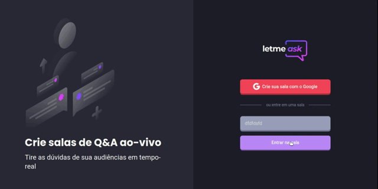
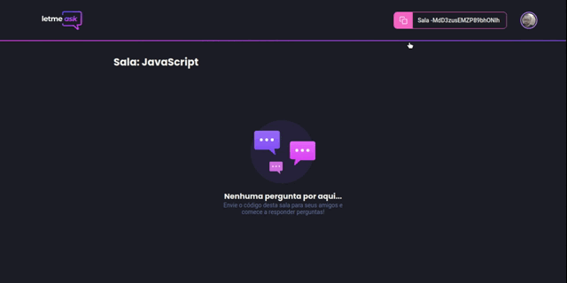
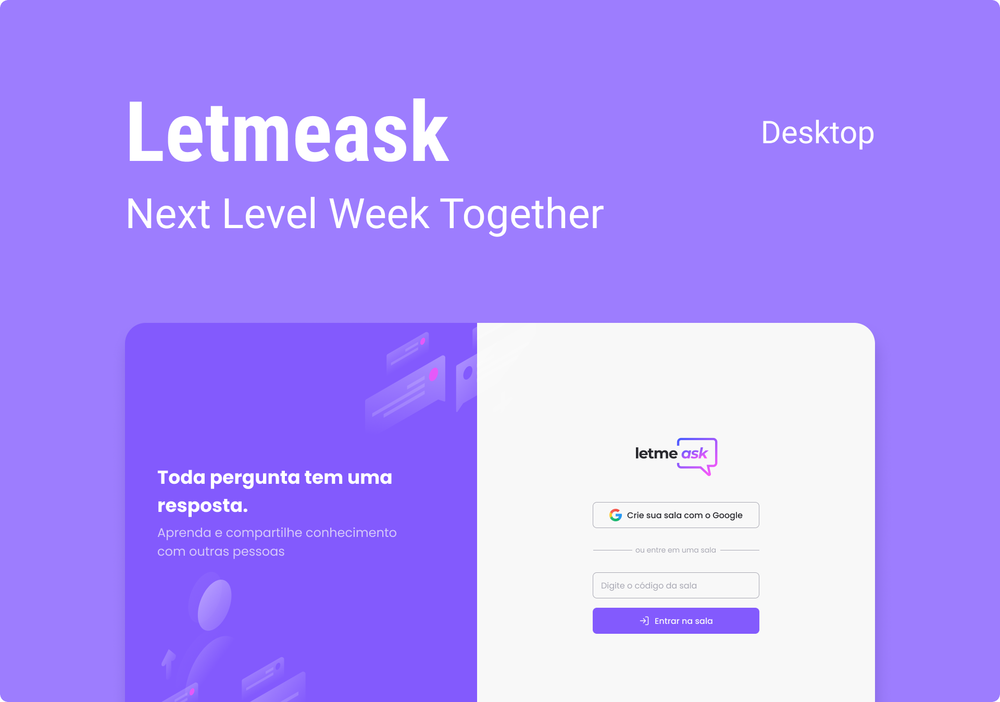

<p align="center">
 
</p>
<p align="center">Tire as dúvidas de suas audiências em tempo-real!</p>
<a href="https://an-letmeask.vercel.app"></a>
<h6 align="center"><b>clique na imagem ☝️ para visitar o site.</b></h6>

<br/>
<p align="center">
 <a href="#technology"></a>
 <a href="#features"></a>
 <a href="#structure"></a>
 <a href="#screenshot"></a>
 <a href="#prototyping"></a>
 <br>
 

 <a href="https://github.com/AntonioNarcilio/letmeask/blob/master/LICENSE">
   
 </a>

 
 <br/>
 <a href="https://www.linkedin.com/in/antonionarcilio/"  target="_blank">
 
 </a>
 <br><br>
</p>

<br>
<h2 id="description"><b>📝 Descrição</b></h2>
<p align="justify">
Projeto desenvolvido durante a semana NLW (Next Level Week) #06 da Rocketseat, Aplicação que tem o intuito de tirar as dúvidas de suas audiências em tempo-real por meio de salas de perguntas e respostas (Q&A).
</p>

<br>
<h2 id="structure"><b>🗃️ Estrutura do projeto</b></h2>
<p align="justify">
O projeto atualmente se encontra na seguinte estrutura definida abaixo 👇.
</p>
<br/>
<details>
<summary>
👈 Clique para expandir
</summary>

```text-plain
.
├── docs
│   └── README-PT_BR.md
├── public
│   ├── favicon.svg
│   └── index.html
├── src
│   ├── assets
│   │   ├── animations
│   │   │   └── 404-space-error.json
│   │   └── images
│   │       ├── answer.svg
│   │       ├── check.svg
│   │       ├── copy.svg
│   │       ├── delete.svg
│   │       ├── empty-questions.svg
│   │       ├── google-icon.svg
│   │       ├── illustration.svg
│   │       ├── like.svg
│   │       ├── logo-dark.svg
│   │       ├── logo-white.svg
│   │       ├── moon.svg
│   │       ├── profile.svg
│   │       └── sun.svg
│   ├── components
│   │   ├── Button
│   │   │   ├── index.tsx
│   │   │   └── style.ts
│   │   ├── CustomToast
│   │   │   └── index.tsx
│   │   ├── Header
│   │   │   ├── index.tsx
│   │   │   └── style.ts
│   │   ├── Modal
│   │   │   ├── index.tsx
│   │   │   └── style.ts
│   │   ├── ProfileDropdown
│   │   │   ├── index.tsx
│   │   │   └── style.ts
│   │   ├── Question
│   │   │   ├── index.tsx
│   │   │   └── style.ts
│   │   └── RoomCode
│   │       ├── index.tsx
│   │       └── styles.ts
│   ├── contexts
│   │   ├── AuthContext.tsx
│   │   ├── ModalYesNoContext.tsx
│   │   └── ThemeSwitchContext.tsx
│   ├── hooks
│   │   ├── useAuth.ts
│   │   ├── useRoom.ts
│   │   └── useTheme.ts
│   ├── pages
│   │   ├── Error
│   │   │   └── 404.tsx
│   │   ├── Others
│   │   │   └── Contact.tsx
│   │   ├── Room
│   │   │   ├── AdminRoom.tsx
│   │   │   ├── NewRoom.tsx
│   │   │   └── Room.tsx
│   │   └── Home.tsx
│   ├── services
│   │   └── firebase.ts
│   ├── styles
│   │   ├── pages
│   │   │   ├── auth.ts
│   │   │   ├── contact.ts
│   │   │   ├── notfound.ts
│   │   │   └── room.ts
│   │   ├── themes
│   │   │   ├── dracula.ts
│   │   │   └── nlw.ts
│   │   └── global.ts
│   ├── @types
│   │   ├── auth-context.d.ts
│   │   ├── button.d.ts
│   │   ├── firebase-questions.d.ts
│   │   ├── header.d.ts
│   │   ├── profile-dropdown.d.ts
│   │   ├── question.d.ts
│   │   ├── room-code.d.ts
│   │   ├── room.d.ts
│   │   ├── styled.d.ts
│   │   └── theme-switch-context.d.ts
│   ├── utils
│   │   └── usePersistedState.tsx
│   ├── App.tsx
│   ├── index.tsx
│   └── react-app-env.d.ts
├── package.json
├── README.md
├── tsconfig.json
└── yarn.lock
```

</details>

<br>
<h2 id="features"><b>🛸 Funcionalidades</b></h2>
<p align="justify">
Quais as funcionalidades que a aplicação `letmeask` possui 🤔 atualmente?
</p>

- [x] Opção de login por meio da conta do google;
- [x] Opção de escolha entre temas dia 🌕 / noite 🌑;
- [x] Opção de criação de sala;
- [x] Opção de adentrar em uma sala existem por meio do código da sala **(usuário não precisa estar logado)**;
- [x] Opção de copiar o código da sala;
- [x] Opção de adicionar perguntas **(apenas para usuário comum e precisa estar logado)**;
- [x] Deixar um gostei em uma pergunta **(apenas usuário comum e precisa estar logado)**;
- [x] Opção de destacar pergunta(s) **(apenas o administrador da sala tem esta opção)**;
- [x] Opção de marcação de pergunta(s) como respondida **(apenas o administrador da sala tem esta opção)**;
- [x] Opção de remoção de pergunta(s) **(apenas o administrador da sala tem esta opção)**;
- [x] Opção de fechar a sala **(apenas o administrador tem esta opção)**;

<br>
<h2 id="technology"><b>🛰️ Tecnologias</b></h2>
<p align="justify">
Este projeto foi desenvolvido utilizando as seguintes tecnologias 👇.</p>
<br/>
<a href="https://reactjs.org">

</a>

<br/>

<a href="https://firebase.google.com/">

</a>

<br/>

<a href="https://www.typescriptlang.org/download">

</a>

<br/>

<a href="https://an-letmeask.vercel.app">

</a>

<br/>

<a href="https://styled-components.com">

</a>

<br>

<a href="https://www.figma.com/file/cniET9Xo3ZIwoqJ4PWcovu/Move.it-1.0?node-id=160%3A2761">

</a>

<br>

<a href="https://www.framer.com/motion/">

</a>

<br>

<a href="https://lottiefiles.com">

</a>

<br>
<h2 id="screenshot"><b>🖥️ Captura de telas</b></h2>
<p align="justify">
Mais abaixo encontra-se algumas capturas de telas demostrando certas funcionalidades da aplicação.
</p>

<table>
  <tr align="center">
    <td><h5>Autenticação e criação de sala</h5></td>
    <td><h5>Entrando em uma sala</h5></td>
  </tr>
  <tr>
    <td></td>
    <td></td>
  </tr>
  <tr align="center">
    <td><h5>Temas escuro (dracula) / claro (nlw)</h5></td>
    <td><h5>Sala do administrador</h5></td>
  </tr>
  <tr>
    <td></td>
    <td></td>
  </tr>
  <tr align="center">
    <td><h5>Mandando uma pergunta</h5></td>
    <td><h5>Autenticação dentro da sala</h5></td>
  </tr>
  <tr>
    <td></td>
    <td></td>
  </tr>
</table>

<br>
<h2 id="prototyping"><b>🏎 Prototipagem</b></h2>
<p align="justify">
Este projeto foi desenvolvido se "baseando" no protótipo definido abaixo, encontrado no figma.</p><br>
<a href="https://www.figma.com/file/0OpBWgGPkoUxdc5AzPcifs/NLW-06-Letmeask?node-id=0%3A1"></a>
<h6 align="center"><b>clique na imagem ☝️ para visualizar o protótipo no figma.</b></h6>


<br>
<h2 id="license"><b>📜 Licença</b></h2>

Este projeto está sob a licença [MIT](./LICENSE)

<br><br>

<p align="center">
criado por <a href="https://linkedin.com/in/antonionarcilio">@antonionarcilio</a>
</p>
